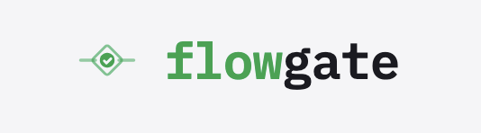
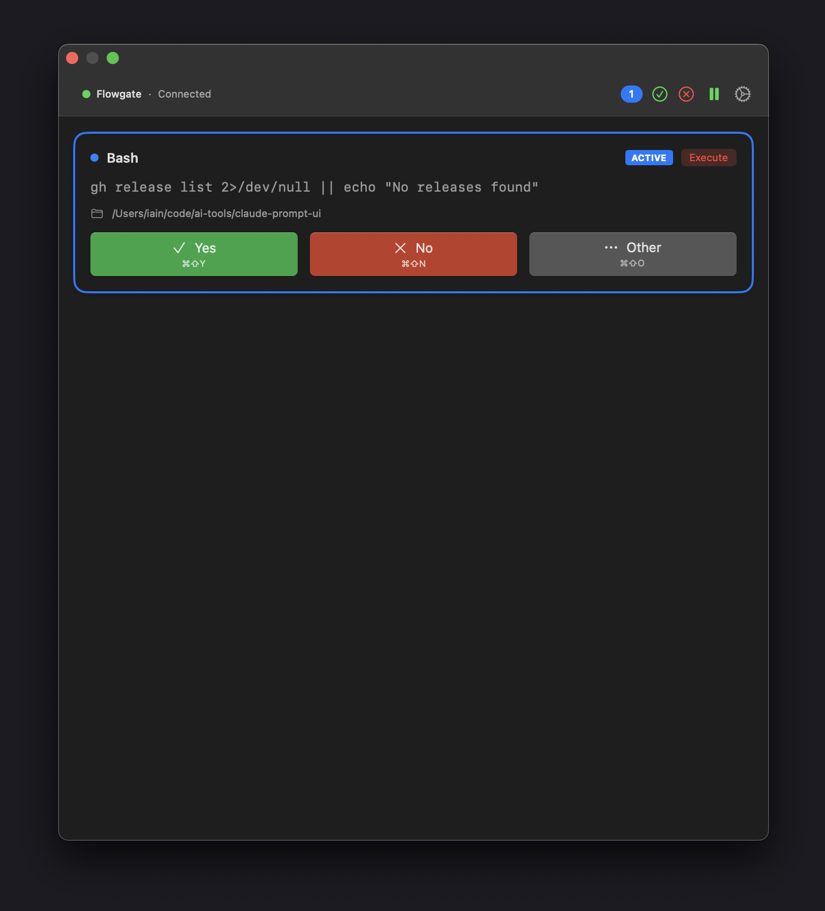
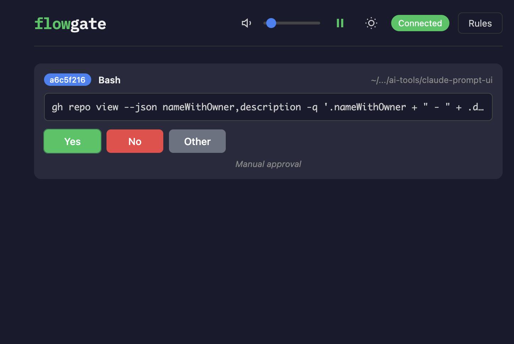
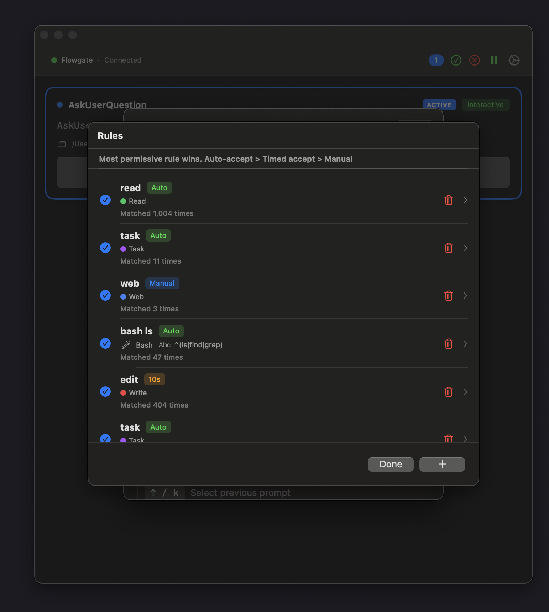

<p align="center">
  
</p>

<h1 align="center">Flowgate</h1>

<p align="center">
  <strong>Take control of your AI agent</strong><br>
  A visual approval interface for Claude Code that lets you review, modify, and approve tool calls before they execute.
</p>

<p align="center">
  
  
  
</p>

---

## Why Flowgate?

When using AI coding assistants like Claude Code, the agent can execute commands, edit files, and make changes to your system. Flowgate gives you a **visual approval layer** that:

- **Shows you exactly what Claude wants to do** before it happens
- **Lets you approve, deny, or modify** each action
- **Works across multiple Claude sessions** simultaneously
- **Integrates with Stream Deck** for hardware button control

<p align="center">
  
</p>

## Installation

### Download the App

1. Download the latest `Flowgate.dmg` from [Releases](https://github.com/iainnash/flowgate/releases)
2. Open the DMG and drag **Flowgate** to your Applications folder
3. Launch Flowgate from Applications

### Configure Claude Code

Add Flowgate as a hook in your Claude Code settings (`~/.config/claude/settings.json`):

```json
{
  "hooks": {
    "PreToolUse": "/Applications/Flowgate.app/Contents/Resources/prompt-hook"
  }
}
```

That's it! Flowgate will now intercept tool calls from Claude Code.

## Features

### Visual Approval Interface

See exactly what Claude wants to do with syntax-highlighted diffs, command previews, and file path context.

<p align="center">
  
</p>

### Configurable Auto-Accept Rules

Set up rules to automatically approve safe operations while requiring manual review for sensitive ones:

- **Auto-accept**: Approve immediately (read operations, safe commands)
- **Accept after timer**: Show countdown, auto-approve if no objection
- **Manual**: Always require explicit approval

<p align="center">
  
</p>

### Multiple Interfaces

- **Native macOS App**: Menu bar icon with floating window
- **Web UI**: Full-featured browser interface
- **Stream Deck**: Hardware buttons for quick approvals

### Multi-Session Support

Handle multiple Claude Code sessions simultaneously with color-coded badges to distinguish between them.

## Security

Flowgate is designed with security as a priority:

### Fully Local

- **No cloud services**: Everything runs on your machine
- **No data collection**: Your code and commands stay private
- **Localhost only**: Server binds to 127.0.0.1

### Token-Based Authentication

- **Automatic token generation**: Secure 32-byte token created on first launch
- **Restricted permissions**: Token file is owner-read-only (0600)
- **No manual setup required**: Just launch the app

### Configurable Permissions

Create rules to control what gets auto-approved:

```
Rule: "Allow read operations"
  Tool: Glob, Grep, Read
  Action: Auto-accept

Rule: "Review file edits"
  Tool: Edit, Write
  Action: Manual approval

Rule: "Allow npm/pnpm after delay"
  Tool: Bash
  Pattern: ^(npm|pnpm)\s
  Action: Accept after 3 seconds
```

## How It Works

```
┌─────────────────────────────────────────────────────────────┐
│                    Claude Code                               │
│  "I want to run: npm install && npm run build"              │
└─────────────────────┬───────────────────────────────────────┘
                      │
                      ▼ PreToolUse hook
┌─────────────────────────────────────────────────────────────┐
│                    Flowgate Hook                             │
│  Sends tool request to local server                         │
└─────────────────────┬───────────────────────────────────────┘
                      │
                      ▼ HTTP POST
┌─────────────────────────────────────────────────────────────┐
│                    Flowgate Server                           │
│  Queues prompt, notifies connected clients                  │
└─────────────┬─────────────────────────┬─────────────────────┘
              │                         │
              ▼ WebSocket               ▼ WebSocket
┌─────────────────────────┐   ┌────────────────────────────────┐
│    Native App / Web UI   │   │    Stream Deck Client          │
│  Shows prompt, waits     │   │  Lights up approval buttons   │
│  for user decision       │   │                                │
└─────────────┬───────────┘   └────────────────────────────────┘
              │
              ▼ User clicks "Yes"
┌─────────────────────────────────────────────────────────────┐
│                    Claude Code                               │
│  Executes: npm install && npm run build                     │
└─────────────────────────────────────────────────────────────┘
```

The hook **blocks** Claude Code until you make a decision, ensuring nothing executes without your approval.

## Building from Source

### Prerequisites

| Tool | Version | Installation |
|------|---------|--------------|
| Go | 1.21+ | `brew install go` |
| Node.js | 20+ | `brew install node` |
| pnpm | 10+ | `npm install -g pnpm` or `brew install pnpm` |
| Xcode | Latest | Mac App Store (required for native app) |

Verify your setup:
```bash
go version      # go1.21 or higher
node --version  # v20 or higher
pnpm --version  # 10 or higher
```

### Clone and Build

```bash
# Clone the repository
git clone https://github.com/iainnash/flowgate.git
cd flowgate

# Install dependencies
pnpm install

# Build all components (server, hook, UI)
pnpm build
```

### Build the macOS App

```bash
# Build Flowgate.app and Flowgate.dmg
./scripts/build-app.sh
```

This creates:
- `build/Flowgate.app` - The application bundle
- `build/Flowgate.dmg` - Installer disk image

### Build Individual Components

```bash
# Go server only
pnpm build:server

# Hook binary only
pnpm build:hook

# Web UI only
pnpm --filter ui build

# Stream Deck client
pnpm build:stream-deck
```

### Running After Build

**Option 1: Native App (Recommended)**
```bash
open build/Flowgate.app
```

**Option 2: Standalone Server**
```bash
# Generate auth token
./scripts/generate-token.sh

# Start the server
./go-server/flowgate-server
```

Then open http://localhost:8888 in your browser.

### Configure Claude Code

Add Flowgate as a hook in `~/.config/claude/settings.json`:

```json
{
  "hooks": {
    "PreToolUse": "/path/to/flowgate/hooks/prompt-hook"
  }
}
```

Use the absolute path to your built hook binary.

### Development Mode

```bash
# Start Go server + Vite dev server with hot reload
pnpm dev

# In another terminal, start Stream Deck client (optional)
pnpm dev:stream-deck
```

### Verify Installation

1. Start Flowgate (app or server)
2. In a terminal, test the hook:
   ```bash
   echo '{"sessionId":"test","toolName":"Bash","toolInput":{"command":"echo hello"},"hookEventName":"PreToolUse","cwd":"/tmp"}' | ./hooks/prompt-hook
   ```
3. A prompt should appear in the Flowgate UI

See [docs/DEVELOPMENT.md](docs/DEVELOPMENT.md) for detailed architecture and troubleshooting.

## Architecture

Flowgate consists of four main components:

| Component | Technology | Purpose |
|-----------|------------|---------|
| **Go Server** | Go, Gorilla WebSocket | Backend API, prompt queue, WebSocket hub |
| **Web UI** | Svelte, Vite | Browser-based approval interface |
| **Native App** | Swift, SwiftUI | macOS menu bar app with embedded server |
| **Hook** | Go | Claude Code integration, sends prompts to server |

All components communicate via WebSocket for real-time updates.

## Documentation

- [Development Guide](docs/DEVELOPMENT.md) - Build instructions and architecture
- [Authentication](docs/AUTHENTICATION.md) - Token-based security details
- [Deployment](docs/DEPLOYMENT.md) - Production deployment options
- [API Reference](docs/API.md) - Server endpoints and WebSocket protocol

## License

MIT

---

<p align="center">
  Built for developers who want visibility into their AI assistant's actions.
</p>
